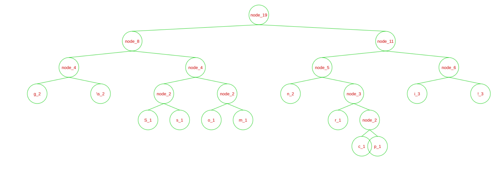

# HuffmanCoding
ZSTU数据结构课程设计，赫夫曼编码/解码，可以可视化构建的赫夫曼树

实现功能如下

1. 通过文件读入需要传输的数据，根据文件中的字符频率构建赫夫曼树

   + 传输的数据是Spring is coming!!!

2. 通过构建的赫夫曼树对传输的数据进行编码

   + 编码结果为010001101010110000001100110010110001111011010111110000001111111111

3. 对编码进行解码

4. 可视化构建出来的赫夫曼树

   如下图所示

   
